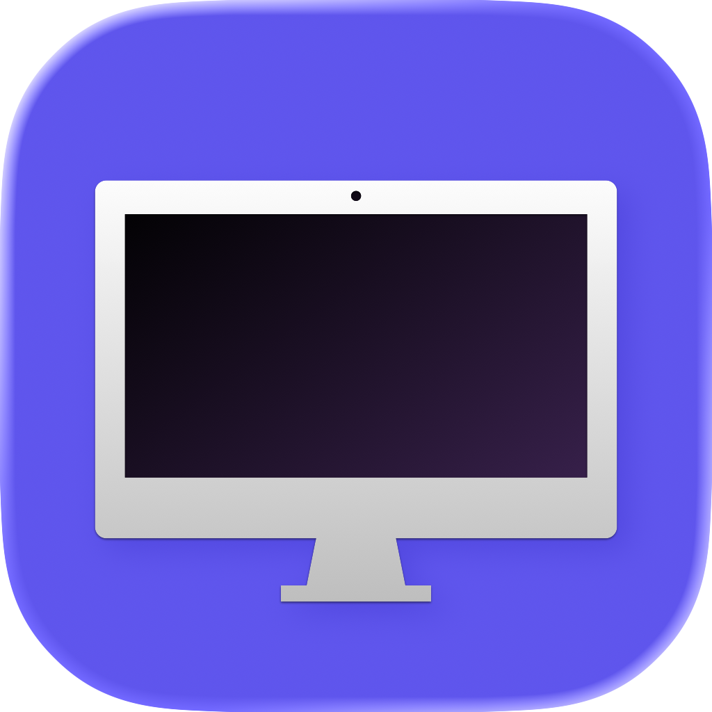
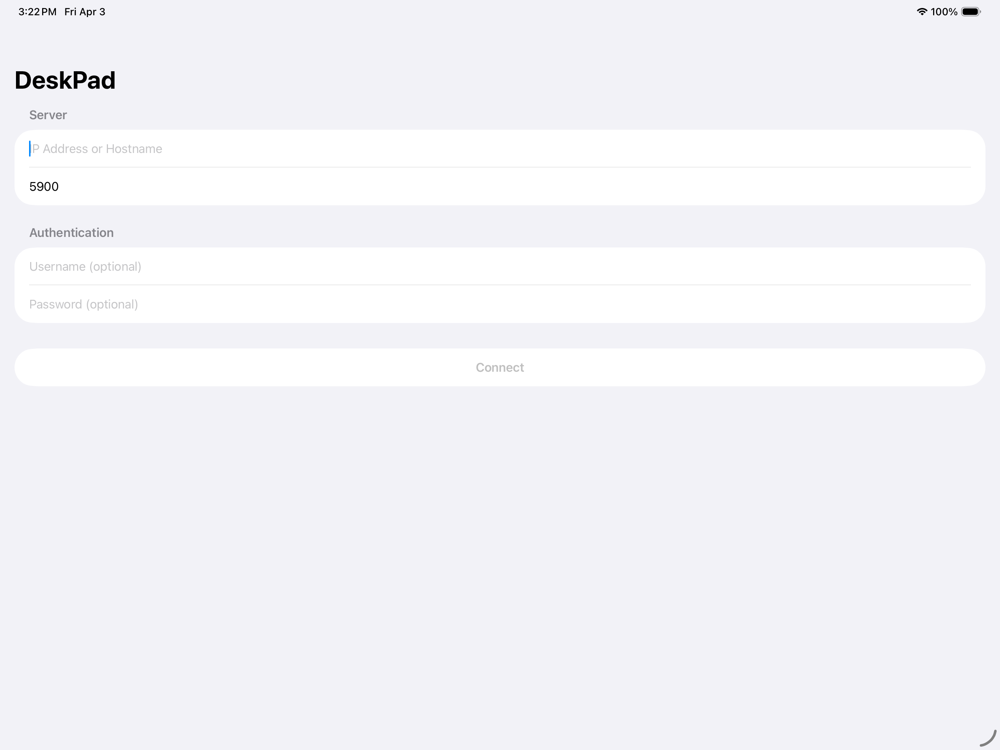
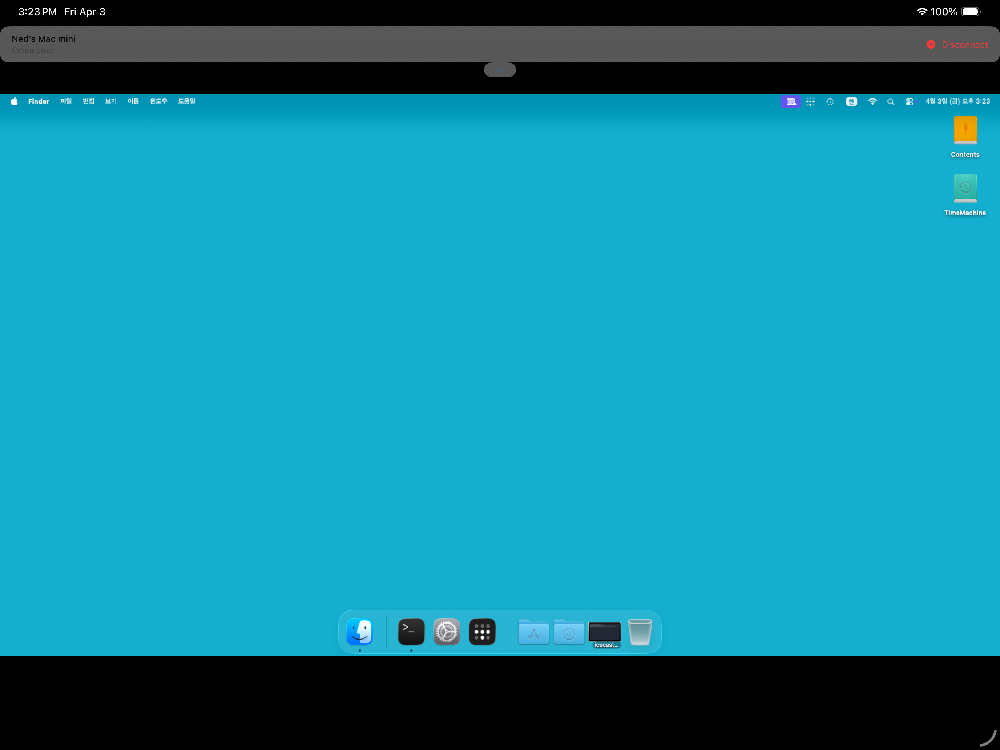

# DeskPad

DeskPad is an open-source VNC client for iPadOS, built with SwiftUI.
It implements core parts of the RFB protocol to connect to remote desktops and interact with them using touch, pointer, and hardware keyboard input.

## App Icon

	

## Screenshots

	
	

## Features
- VNC connection flow with RFB handshaking and session setup
- Password-based VNC authentication (including DES challenge response)
- Framebuffer rendering for remote desktop updates
- Remote input forwarding:
	- Keyboard key down/up events
	- Pointer move/click events
	- Scroll input handling
- Zoom and pan support in the remote desktop view
- SwiftUI app structure with a UIKit-backed rendering/input view for desktop interaction

## Tech Stack
- Swift
- SwiftUI + UIKit interoperability
- Network.framework
- CoreGraphics
- CommonCrypto

## Project Structure
- `DeskPad/Network`: VNC connection lifecycle and socket communication
- `DeskPad/Protocol`: RFB message encoder/decoder and authentication helpers
- `DeskPad/Framebuffer`: Pixel buffer and image generation for rendering
- `DeskPad/Input`: Key symbol mapping and input event forwarding
- `DeskPad/Views`: Connection UI, remote desktop view, and session toolbar

## Requirements
- Xcode 26 or later
- iPadOS 26.0 or later
- This app requires a hardware keyboard and a pointing device, including the iPad Magic Keyboard.

## Getting Started
1. Clone the repository.
2. Open `DeskPad/DeskPad.xcodeproj` in Xcode.
3. Select an iPad simulator or a physical iPad device.
4. Build and run the `DeskPad` target.

## Usage
1. Launch the app.
2. Enter the VNC server host, port, and credentials (if required).
3. Connect and start interacting with the remote desktop.

## Security Note
- Use DeskPad only on trusted networks or through secure tunnels/VPN when accessing remote systems.
- Avoid exposing VNC servers directly to the public internet.

## Roadmap
- Additional RFB encoding support
- Better reconnection and session resilience
- Improved keyboard/layout coverage
- UI/UX improvements for multitasking workflows on iPad

## Contributing
Issues and pull requests are welcome.
If you plan a larger change, please open an issue first to discuss scope and implementation direction.

## Credits
- [Ned Park](https://africastart.com)

## License
Licensed under the [MIT](LICENSE) license.
